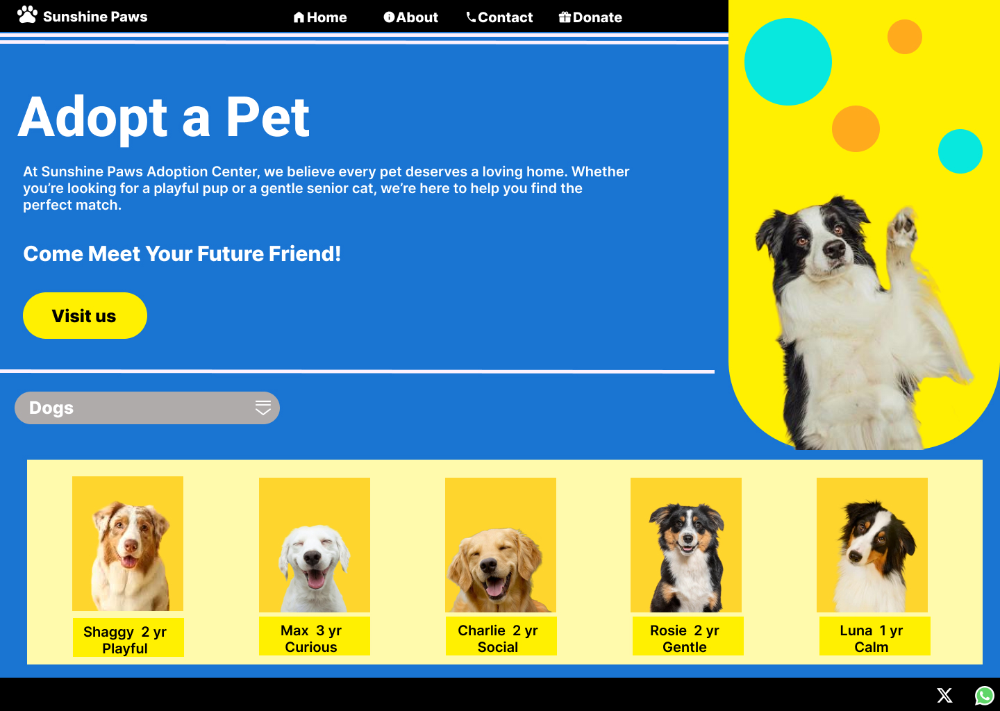
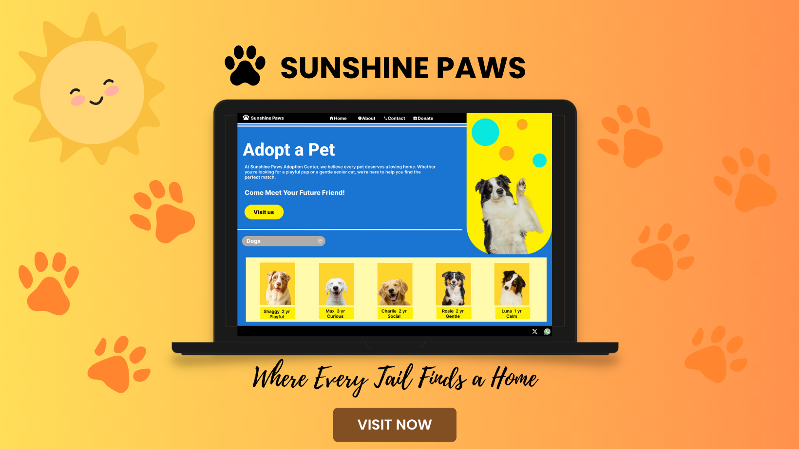
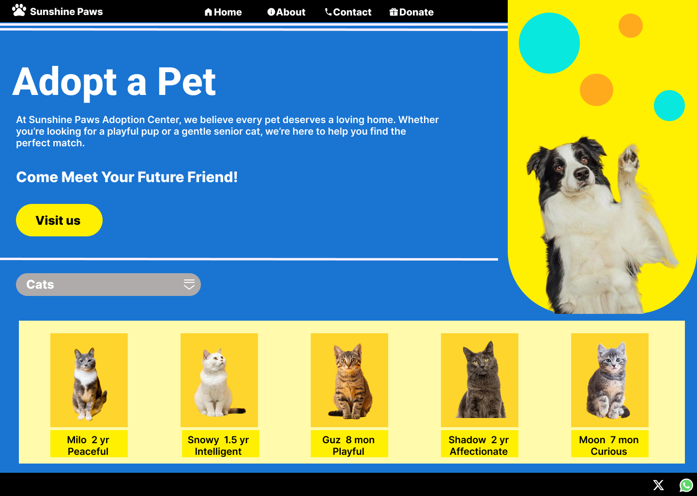
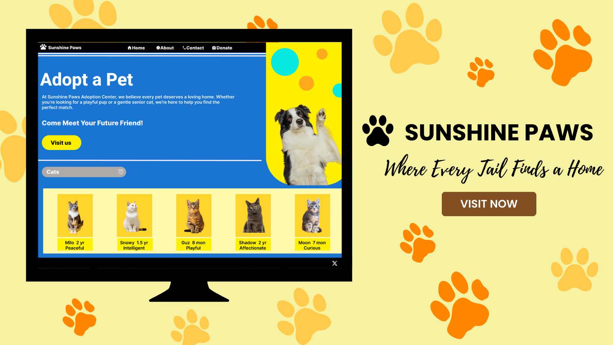
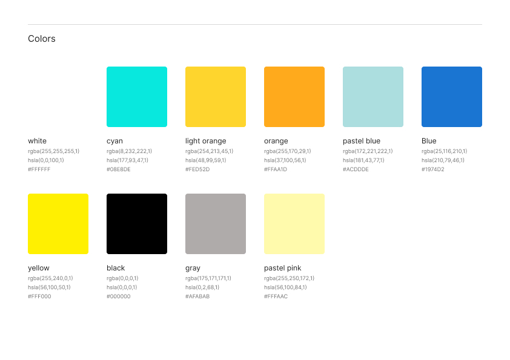

# 🌞🐾 Sunshine Paws – Pet Adoption Homepage

**Elevvo Pathways – Task 3**

This project is a **Pet Adoption Homepage design** created as part of **Elevvo Pathways Task 3**.

---

## ✨ Features

- 🐕 **Welcoming Message with Hero Image** – creates a warm first impression
- 🐾 **Featured Pets Section** – includes pet image, name, and age
- 🎨 **Bright & Friendly Colors** – builds trust and positive emotions

---

## 🛠️ Tools

- **Figma** – UI/UX design and prototyping
  **Canva** – graphics, mockups, and presentation

---

## 📸 Preview

### Dogs

### Cats

---

### Color Style

---

## 🚀 How to View

1. Open the design files in **Figma**.
2. Explore both themes and the interaction flow.

👉 [Figma Link](https://www.figma.com/design/hw1oERyTpjCOf8oUn2hfXJ/Task1-3?node-id=76-841&t=B2akot0G6x1iHgUe-1)

---

## 🏷️ License

This project was created for **Elevvo – Task 3**.  
Free to use for **learning** and **portfolio** purposes.
